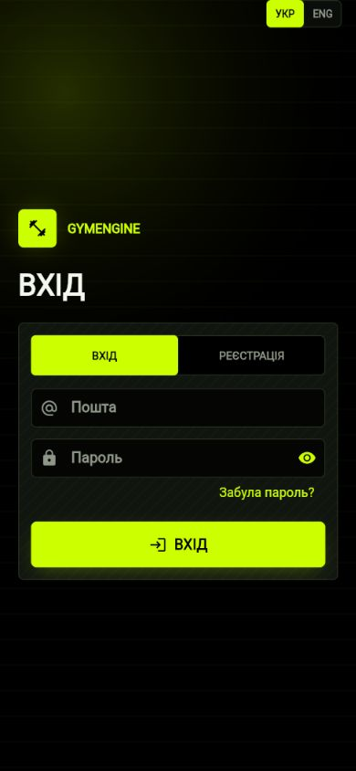
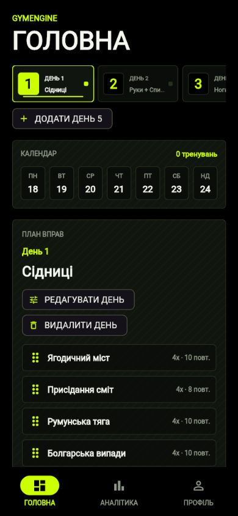
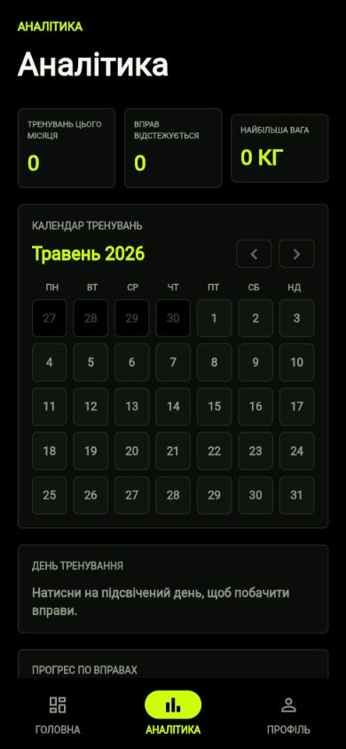

# GymEngine


**GymEngine** is a fullstack, mobile-first strength training app built for fast workout logging, structured training plans, and clean progress analytics.

The goal is simple: make a gym app that feels like a real product, not a spreadsheet. GymEngine focuses on fast data entry during training, offline-first reliability, account-based sync, and a dark industrial interface with a premium mobile experience.

---

## ✨ Features

- **Authentication flow** with registration, login, email verification codes, and password reset codes.
- **Offline-first workout tracking** using a local Drift/SQLite database.
- **Custom training day builder** with up to 7 program days.
- **Exercise planning** with target sets, target reps, muscle groups, and exercise notes.
- **Active workout mode** for logging weight, reps, sets, and rest time.
- **Rest timer notifications** on Android.
- **Calendar analytics** with monthly navigation and training-day details.
- **Exercise statistics** with minimum / maximum weight and reps.
- **Localization** with Ukrainian as the default language and English as an optional UI language.
- **Theme support** with dark and light mode.
- **Server sync foundation** for account-based backup and restore.
- **Mobile-first responsive UI** with animated interactions and Electric Lime visual branding.

---

## 🧠 Problem Solved

Most fitness trackers are either too slow during a real workout or too visually noisy. GymEngine is designed around one core workflow:

> Open the app, start the planned day, log sets fast, rest, continue, and review progress later.

The app keeps the training experience focused while still preserving enough data for meaningful analytics: what was trained, when it was trained, which weights were used, and how performance changes over time.

---

## 🛠️ Tech Stack

### Mobile

- Flutter
- Dart
- BLoC / Cubit
- Drift
- SQLite
- Dio
- fl_chart

### Backend

- Node.js
- NestJS
- TypeScript
- JWT-style token auth
- Nodemailer / SMTP-ready email delivery

### Persistence

- Local mobile database: **Drift + SQLite**
- API development storage: local file-backed storage
- Production-ready direction: PostgreSQL-ready architecture

---

## 📸 Screenshots

### Authentication



### Home / Training Plan



### Analytics



---

## 🏗️ Architecture

```text
gym-engine/
│
├── apps/
│   └── mobile/
│       ├── lib/
│       │   ├── core/
│       │   ├── data/
│       │   ├── domain/
│       │   └── presentation/
│       ├── android/
│       ├── ios/
│       └── pubspec.yaml
│
├── services/
│   └── api/
│       ├── src/
│       │   ├── auth/
│       │   ├── sync/
│       │   └── main.ts
│       └── package.json
│
├── screenshots/
│   ├── mobile-view.png
│   ├── home-page.png
│   └── dashboard.png
│
├── docs/
├── infra/
├── README.md
└── .gitignore
```

---

## 🔐 Backend Functionality

- Register user account.
- Send email verification code.
- Confirm account only after code verification.
- Login with email and password.
- Request password reset code.
- Confirm password reset with code and new password.
- Upload authenticated sync snapshots.
- Restore user data from the server.

Email delivery is SMTP-ready through environment variables. Without SMTP credentials, the API writes development emails to a local outbox file for testing.

---

## 🚀 Installation

### 1. Clone the repository

```bash
git clone https://github.com/sashik117/GymEngine-.git
cd GymEngine-
```

### 2. Run the API

```bash
cd services/api
npm install
npm run build
npm run start
```

Create a `.env` file from the example if you want real email delivery:

```bash
cp .env.example .env
```

### 3. Run the mobile app

```bash
cd apps/mobile
flutter pub get
flutter run
```

For this workspace, a helper script is also available:

```powershell
.\tools\flutter.ps1 --version
```

---

## 🧪 Testing

### Mobile

```bash
cd apps/mobile
flutter analyze lib test
flutter test
```

### API

```bash
cd services/api
npm run build
```

---

## 🌍 Live Demo

Deployment is planned. Current testing is focused on local API + Android APK builds.

---

## 📌 Project Goals

- Build a real product-style fitness app for a developer portfolio.
- Keep the UI mobile-first, clean, animated, and practical.
- Demonstrate fullstack thinking: local database, backend auth, sync, and analytics.
- Keep the repository structured like a production project.
- Make the project visually strong enough to be featured on a GitHub profile.

---

## 👤 Contact

- GitHub: [@sashik117](https://github.com/sashik117)
- Email: `sanyoklolik@gmail.com`
