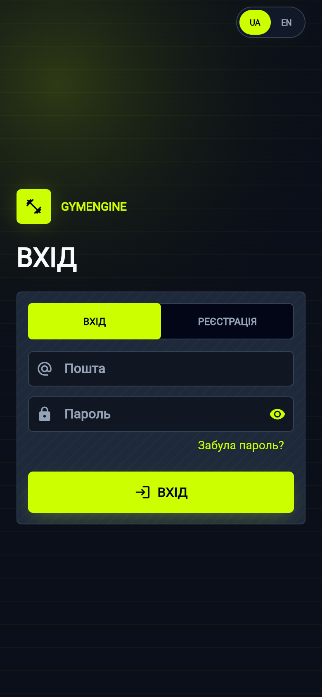
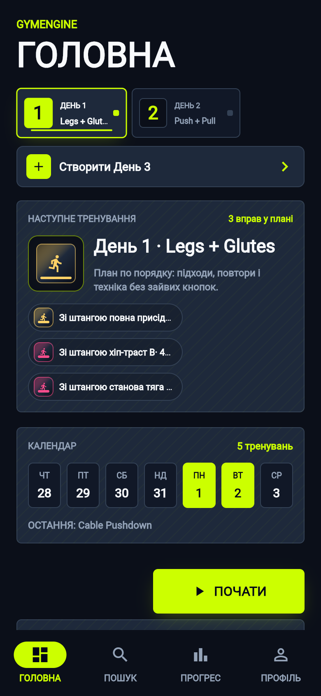
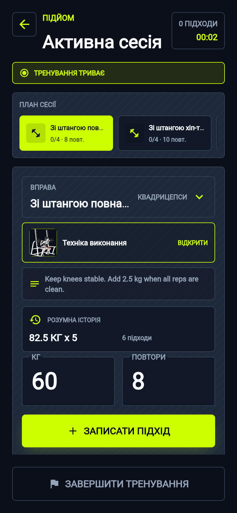
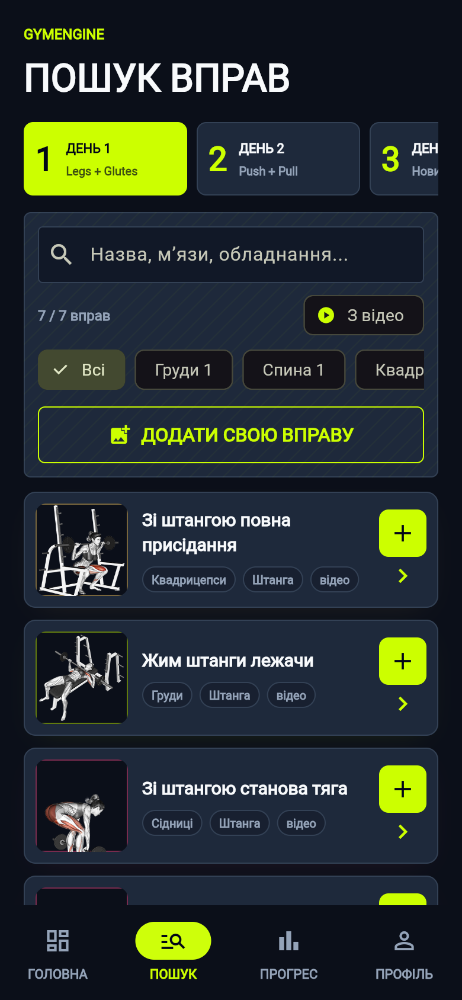
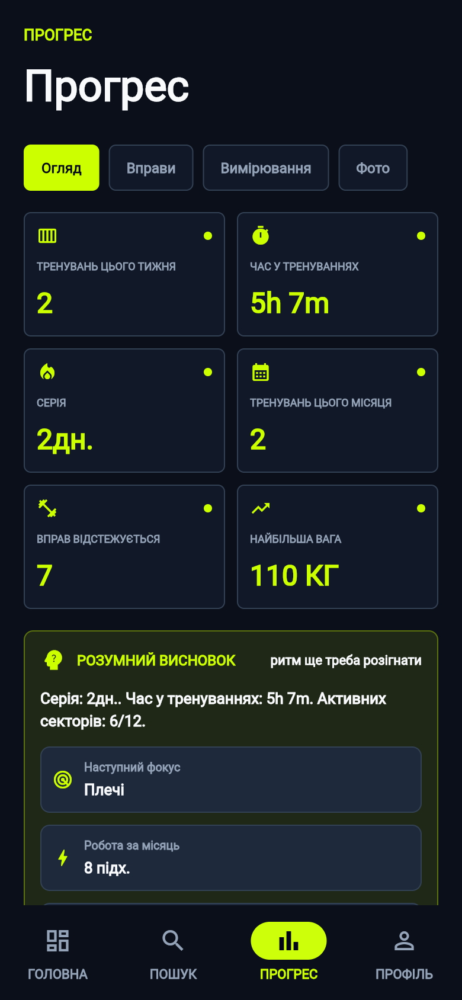
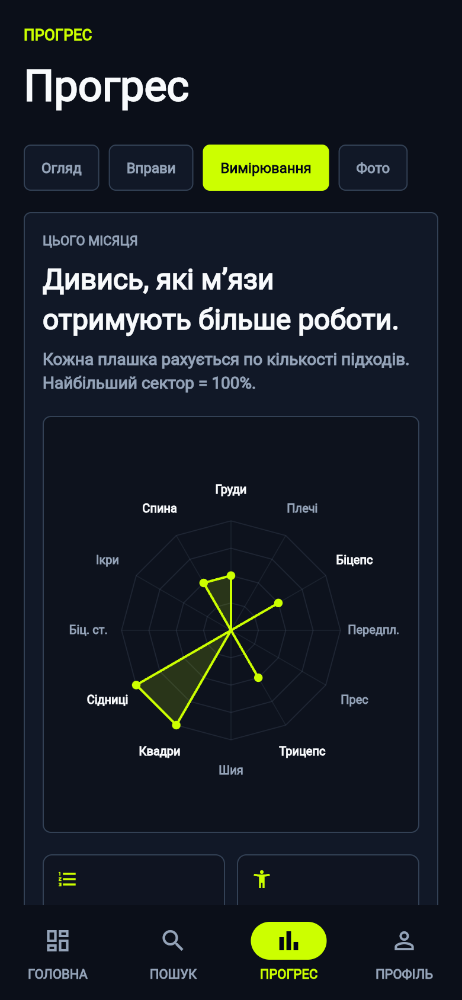
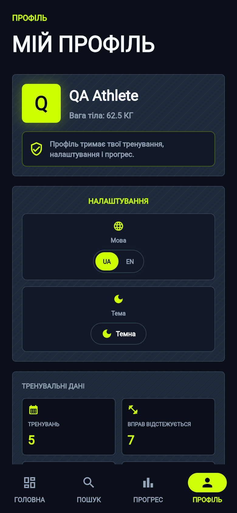

# GymEngine


**GymEngine** is a fullstack, mobile-first strength training app focused on fast workout logging, custom training plans, offline reliability, and progress analytics.

It is designed as a real product experience: dark industrial UI, Ukrainian / English localization, account authentication, local database persistence, server backup, exercise search with media, active workout tracking, rest timers, and progress insights.

---

## ✨ Features

- **Authentication** with registration, login, email verification codes, and password reset codes.
- **Offline-first workout data** stored locally with Drift + SQLite.
- **Account-based backup / restore** through a NestJS API.
- **Custom training plans** with up to 7 workout days.
- **Exercise search catalog** with muscle filters, equipment tags, images, and technique video links.
- **Custom exercises** with user-added photos.
- **Active session mode** with set logging, planned exercise progress, workout timer, rest timer, and set undo.
- **Smart session persistence** so an unfinished workout can be resumed instead of silently disappearing.
- **Progress dashboard** with weekly/monthly stats, streaks, max weight, tracked exercises, and training calendar.
- **Muscle focus analytics** showing which muscle sectors need more attention.
- **Profile settings** with language switcher, dark/light theme, and training stats.
- **Mobile-first responsive UI** optimized for phone use, with a centered app frame on desktop web.

---

## 🧠 Problem Solved

Most fitness apps become slow during a real workout: too many taps, too much visual noise, and weak history tracking. GymEngine solves that by keeping the main flow simple:

> Build a training day → start the session → log sets fast → rest → continue → review progress later.

The app is built around practical gym behavior: poor internet in a basement gym, quick weight/reps entry, planned sets and reps, exercise technique references, and progress that is easy to understand.

---

## 🛠️ Tech Stack

### Mobile

- Flutter
- Dart
- BLoC / Cubit
- Drift
- SQLite
- Dio
- fl_chart

### Backend

- Node.js
- NestJS
- TypeScript
- JWT-style token authentication
- Email-code auth flow
- File-backed development storage with PostgreSQL-ready architecture direction

### Quality

- Flutter analyzer
- Flutter unit/widget tests
- Jest backend tests
- Playwright visual QA screenshots
- Android release APK build

---

## 📸 Screenshots

### Authentication



### Home / Training Plan



### Active Workout Session



### Exercise Search



### Progress Overview



### Muscle Focus Measurements



### Profile Settings



---

## 🏗️ Architecture

```text
gymengine/
├── apps/
│   └── mobile/
│       ├── lib/
│       │   ├── core/          # theme, localization, widgets, utilities
│       │   ├── data/          # Drift database, repositories, sync client, catalog
│       │   ├── domain/        # models and pure calculators
│       │   └── presentation/  # Cubits, screens, UI widgets
│       ├── android/
│       ├── ios/
│       └── pubspec.yaml
│
├── services/
│   └── api/
│       ├── src/
│       │   ├── auth/          # registration, verification, login, reset
│       │   ├── domain/        # backend domain utilities
│       │   └── sync/          # user snapshot backup / restore
│       └── package.json
│
├── screenshots/
│   └── qa/                    # Playwright-generated visual QA screenshots
├── tools/
│   └── visual-qa-gymengine.mjs
├── docs/
├── README.md
└── package.json
```

---

## 🔐 Backend Functionality

- Register a new user.
- Send or expose local verification codes for development.
- Verify email before account activation.
- Login with email and password.
- Request and confirm password reset codes.
- Store authenticated user sync snapshots.
- Restore all user data by user ID after login.

For local development without SMTP credentials, the API exposes development codes so the flow can be tested without a real mailbox.

---

## 🚀 Local Development

### API

```bash
cd services/api
npm install
npm run build
npm run start
```

Default local API:

```text
http://127.0.0.1:3017/api
```

### Flutter App

```bash
cd apps/mobile
flutter pub get
flutter run
```

### Web Preview

The local web preview is served on:

```text
http://127.0.0.1:5177
```

---

## 🧪 Testing

### Mobile

```bash
cd apps/mobile
flutter analyze lib test
flutter test
flutter build web --release
flutter build apk --release
```

### Backend

```bash
cd services/api
npm test
npm run build
```

### Visual QA

```bash
node tools/visual-qa-gymengine.mjs
```

The script creates a QA user, uploads realistic training data, opens the web app, and saves screenshots to:

```text
screenshots/qa/
```

---

## 📦 Android APK

Latest release APK path after build:

```text
apps/mobile/build/app/outputs/flutter-apk/app-release.apk
```

---

## 🌍 Live Demo

Deployment is planned. Current validation is focused on local API, web preview, Android APK builds, and portfolio-ready screenshots.

---

## 🎯 Project Goals

- Build a fullstack fitness product that looks and behaves like a real app.
- Demonstrate clean Flutter architecture with local persistence and sync.
- Show backend auth, verification, password reset, and user-scoped data restore.
- Keep the UI mobile-first, visually strong, and practical for real gym use.
- Make the repository strong enough for a junior/fullstack developer portfolio.

---

## 👤 Contact

- GitHub: [@sashik117](https://github.com/sashik117)
- Email: `sanyoklolik@gmail.com`
